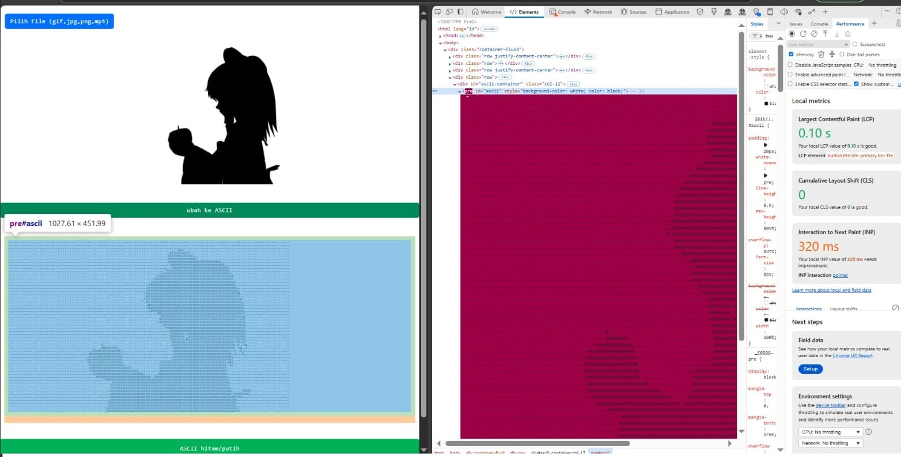

# ascii-art-html-js-canvas

**ASCII Art** adalah bentuk seni yang menggunakan karakter teks untuk menggambarkan gambar atau objek visual. Alih-alih menggunakan pixel atau vektor, seni ASCII membangun gambar menggunakan simbol-simbol seperti huruf, angka, dan karakter lainnya. Ini adalah cara klasik untuk membuat gambar menggunakan teks, yang dapat ditampilkan di berbagai media yang hanya mendukung karakter teks.

**ascii-art-html-js-canvas** adalah proyek yang memungkinkan Anda untuk mengonversi gambar (JPG, GIF, PNG) atau video (MP4) menjadi seni ASCII menggunakan HTML, JavaScript, dan Web Engine. Proyek ini memanfaatkan elemen `<canvas>` di HTML dan JavaScript untuk menghasilkan seni ASCII yang ditampilkan langsung di halaman web.
